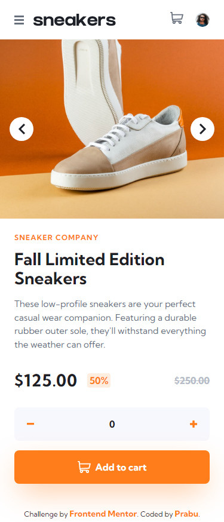
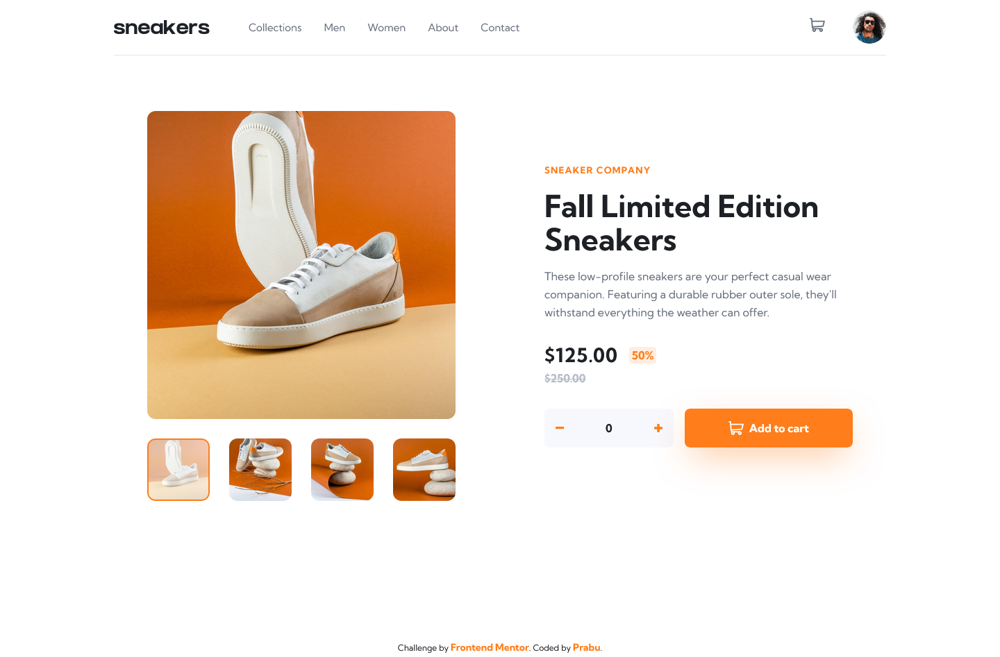

# FEM - Ecommerce Product Page

### Links

[Challenge from FrontendMentor](https://www.frontendmentor.io/challenges/ecommerce-product-page-UPsZ9MJp6)\
[Live site here](https://mgksp-fem-ecommerce-product-page.netlify.app/)

### Built with

- vite
- react
- typescript
- tailwindcss
- framer-motion

### Screenshots

<table>
  <tr>
    <td>Mobile Version</td>
    <td>Desktop Version</td>
  </tr>
  <tr valign="top">
    <td></td>
    <td></td>
  </tr>
</table>
